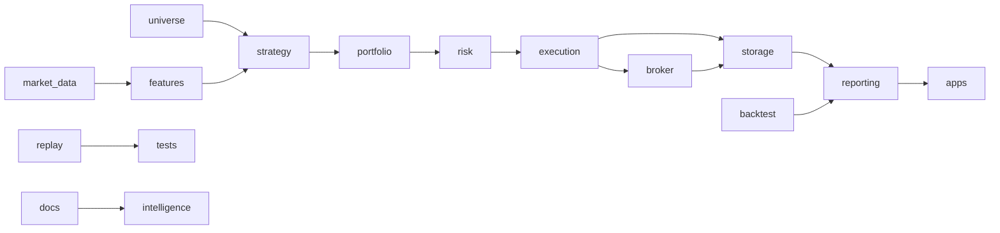

# Canonical Architecture

## Purpose
Normalize the project into a disciplined architecture system without changing trading behavior. The architecture separates reusable trading domain layers, app orchestration, research experiments, task artifacts, Graphify inputs, and archived references.

## Canonical Layers

| layer | responsibility | canonical location | must not do |
|---|---|---|---|
| market_data | Ingest, normalize, and validate market data. | `src/market`, future `src/market_data` | Place orders or compute final strategy decisions. |
| universe | Select tradable symbol sets and rankings. | `src/universe` | Call broker APIs. |
| features | Compute indicators and feature frames. | `src/strategy/conditions.py`, future `src/features` | Own portfolio allocation or execution. |
| strategy | Convert features into candidate signals. | `src/strategy` | Import broker/execution or submit orders. |
| risk | Approve, reject, or size final actions. | `src/risk` | Compute alpha signals or call broker directly. |
| execution | Manage order lifecycle, idempotency, cancel, and terminal states. | `src/execution` | Compute alpha signals. |
| portfolio | Allocate capital and position exposure. | `src/portfolio` | Call broker directly. |
| broker | Broker clients, auth, and external API adapters. | `src/integration` | Decide strategy or risk approval. |
| storage | Durable state, schemas, and persistence. | `src/state` | Contain trading strategy logic. |
| reporting | Reports, metrics, and attribution. | `src/reporting`, `src/analytics` | Submit orders. |
| intelligence | LLM/Codex/Graphify context and advisory outputs. | `docs/graphify`, `skills`, future `src/intelligence` | Create trading decisions or call execution. |
| apps | CLI/Streamlit/app entrypoints and orchestration. | `src/app`, `src/ui` | Own core business logic. |
| backtest | Historical simulation engines and adapters. | `src/backtest` | Depend on live broker clients. |
| replay | Deterministic event/broker replay. | `tests/replay`, future `src/replay` | Submit real broker requests. |
| tests | Regression and boundary validation. | `tests` | Own production behavior. |
| docs | Specs, contracts, operating system, reports. | `docs` | Replace executable tests. |
| experiments | Research scripts and task runs. | `experiments`, future migration from `src/backtest/analysis_*` | Be imported by production runtime. |
| archive | External references and obsolete artifacts. | `archive` | Enter production graph by default. |

## Hard Dependency Rules

- `strategy` must not import `broker`, `execution`, or `integration`.
- `intelligence` must not create trading decisions and must not import `execution`.
- `backtest` must not import live broker adapters such as `src/integration/kis_client.py`.
- `execution` must not compute alpha signals or import strategy condition modules.
- `risk` is the final approval gate before execution.
- `apps` may orchestrate layers but must not contain durable domain rules.
- Task scripts must not remain production runtime modules unless explicitly promoted.
- External reference code must not be included in the production Graphify graph.

## Target Flow

