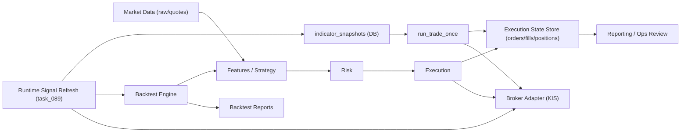

# 아키텍처 / Phase / 백테스트-실거래 경계 감사 보고서 (2026-05-02)

## 1) 감사 범위 및 최종 결론

- 감사 범위:
  - 아키텍처 의도와 실제 구현의 정합성
  - 문서상 Phase와 코드상 진척도의 차이
  - 백테스트와 실거래의 분리/결합 지점 및 운영 리스크
- 근거 소스:
  - `docs/architecture/canonical_architecture.md`
  - `phases/phase-00-project-operating-system.md`, `phases/phase-01-repository-foundation.md`, `phases/phase-02-context-inventory.md`
  - `src/backtest/engine.py`, `src/backtest/engine_full.py`
  - `src/app/task_089_market_data_signal_refresh.py`, `src/app/run_trade_once.py`
  - `src/state/store.py`
  - `docs/contracts/mapping_contract_execution_backtest.md`, `docs/contracts/execution_state_contract.md`

### 최종 결론

- 판정: **부분 결합 (partial coupling)**.
- 요약:
  - 백테스트 엔진은 실브로커 API에 직접 의존하지 않아 분리 상태가 양호함.
  - 런타임 시그널 생성에서 백테스트 로직 재사용이 존재하며 이는 의도된 운영 결합으로 해석 가능.
  - 기본 DB(`trading.db`) 단일 경로 공유로 시그널 스냅샷과 주문/체결 상태가 혼재될 수 있어 운영 리스크가 큼.

---

## 2) 아키텍처 Mermaid 다이어그램

해석:
- `H -> B`는 전략 일관성을 위한 백테스트 로직 재사용 축.
- `J`가 `E`와 `H`를 동시에 참조하는 지점이 결합 hotspot.
- `K`와 `F`가 동일 DB 기본 경로를 공유하면 경계 오염 가능성이 생김.

---

## 3) 의도 아키텍처 vs 구현 아키텍처 비교

| 레이어 | 의도된 책임 | 금지사항(의도) | 구현 근거 | 판정 |
|---|---|---|---|---|
| `backtest` | 과거 데이터 시뮬레이션/분석 | 라이브 브로커 의존 | `src/backtest/engine.py`, `src/backtest/engine_full.py` (브로커 import 없음) | Green |
| `integration` | 브로커/인증/외부 연동 | 전략/리스크 의사결정 | `src/integration/kis_client.py`, `src/integration/kis_auth_manager.py` | Green |
| `app` | 운영 오케스트레이션 | 핵심 도메인 규칙 소유 | `run_trade_once`, `task_089`에서 런타임 조합 | Yellow |
| `execution/state` | 주문 생명주기/영속 상태 | 알파 시그널 계산 | `src/execution/*`, `src/state/store.py` | Green |
| `strategy/risk` | 시그널/리스크 판단 | 브로커 직접 호출 | `src/strategy/*`, `src/risk/*` | Green |

핵심 관찰:
- `src/app/task_089_market_data_signal_refresh.py`는 `KISClient`와 `backtest.engine_full`를 동시에 사용함.
- 앱 오케스트레이션 레이어의 의도된 결합으로 볼 수 있으나, 변경 시 경계 붕괴 위험이 있어 관리 포인트임.

---

## 4) Phase 문서와 실제 코드 진척도

### 문서상 Phase

- Phase 00: 운영체계/거버넌스 부트스트랩
- Phase 01: 저장소 기초 규약/엔트리포인트 표준화
- Phase 02: 컨텍스트 인벤토리 및 인덱싱

### 실제 코드 진척

- 실거래/페이퍼 운영 루프 구축:
  - 단건 실행, 루프 실행, reconciliation, cancel, idempotency, fill 보정
- 백테스트 체계 구축:
  - quick/full 엔진 + 다수 분석 스크립트
- 런타임 시그널 파이프라인 구축:
  - 시세 수집 + indicator snapshot 적재 + 진입 후보 선별

요약:
- Phase 문서는 기반 단계 중심인데, 코드는 이미 운영/백테스트 고도화 단계까지 진행되어 있음.
- 기능 버그는 아니지만 “문서의 단계 서사”와 “코드 성숙도” 간 차이는 존재함.

---

## 5) Backtest-실거래 경계 감사 결과

### Q1. 백테스트 엔진이 실브로커 API를 직접 호출하는가?

- 결과: **아니오**.
- 근거:
  - `src/backtest/engine.py`, `src/backtest/engine_full.py`에서 `integration.kis_client`/`KISClient` 참조 없음.
- 판정: **Green (정상 분리)**.

### Q2. 실거래 실행 경로가 백테스트 산출물에 의존하는가?

- 결과: **부분 의존 있음**.
- 근거:
  - `run_trade_once`는 `indicator_snapshots`를 읽어 런타임 진입 후보를 선택.
  - `task_089`는 `backtest.engine_full` 로직을 사용해 snapshot 생성.
- 판정: **Yellow (의도된 운영 결합)**.

### Q3. DB 공유가 시그널 수준인지, 주문/체결 상태까지 섞이는가?

- 결과: **섞임(혼재) 가능**.
- 근거:
  - `task_089`는 `TRADING_DB_PATH` 기본 `trading.db`에 `indicator_snapshots` 기록.
  - `state.store`/`run_trade_once`는 동일 경로 DB에 `trade_runs`, `orders`, `fills`, `positions`, reconciliation 저장.
- 판정: **Red (리스크 결합)**.

### Q4. 실거래 API 실패가 백테스트 워크플로우에 영향 주는가?

- 결과:
  - 백테스트 엔진 단독 실행에는 영향 없음.
  - 런타임 시그널 refresh(`task_089`)는 KIS 의존.
- 판정: **엔진 기준 Green / 운영 시그널 기준 Yellow**.

---

## 6) 시나리오 체크리스트 결과

### 시나리오 A: 백테스트 단독 실행 시 KIS 인증/네트워크 의존 없음

- 결과: **Pass**.
- 근거: 엔진 경로의 브로커 import/호출 부재.

### 시나리오 B: `indicator_snapshots`가 없을 때 `run_trade_once` fail-safe

- 결과: **조건부 fail-safe**.
- 동작:
  - snapshot 테이블이 있고 진입 후보가 없으면 `SKIPPED_NO_SIGNAL`.
  - snapshot 테이블 자체가 없으면 런타임 모드 비활성으로 간주되고 기본 심볼/사이드 경로로 진행 가능.
- 판정: 엄격한 무신호 보호 관점에서 **개선 필요**.

### 시나리오 C: 동일 DB 사용 시 교차 오염 가능성

- 결과: **리스크 확인**.
- 판정: 운영 안전성 관점에서 우선순위 높음.

---

## 7) 우선순위 리스크 및 권고안

### P1 (High): DB 경계 불명확 (Red)

- 리스크:
  - 실거래 상태와 백테스트성 시그널 스냅샷이 동일 DB 파일에 공존.
- 권고:
  - 환경별 DB 강제 분리(`paper/live/backtest`).
  - live 시작 시 DB 경로/환경 계약 위반이면 즉시 중단하는 가드 추가.

### P2 (Medium): snapshot 미존재 시 fallback 실행

- 리스크:
  - 런타임 시그널 파이프라인 미준비 상태에서도 실행이 진행될 수 있음.
- 권고:
  - live 기본 strict 모드: snapshot 존재/신선도 미충족 시 `SKIPPED_NO_SIGNAL` 또는 `FAILED_PRECONDITION`.

### P3 (Medium): `task_089` 결합 hotspot

- 리스크:
  - 운영 스크립트 변경 시 경계 침범 가능성 증가.
- 권고:
  - 현재 구조 유지 가능하나 “의도된 adapter”임을 문서로 고정.
  - 추후 `runtime_signal_adapter`로 분리해 앱 스크립트는 orchestration만 담당하도록 정리 권장.

---

## 8) 한 줄 의사결정

- 현재 구조는 “완전 분리”가 아니라 **가드가 필요한 부분 결합 구조**이며, 즉시 조치의 최우선은 **DB 환경 분리 정책**과 **실행 전 precondition 엄격화**임.
