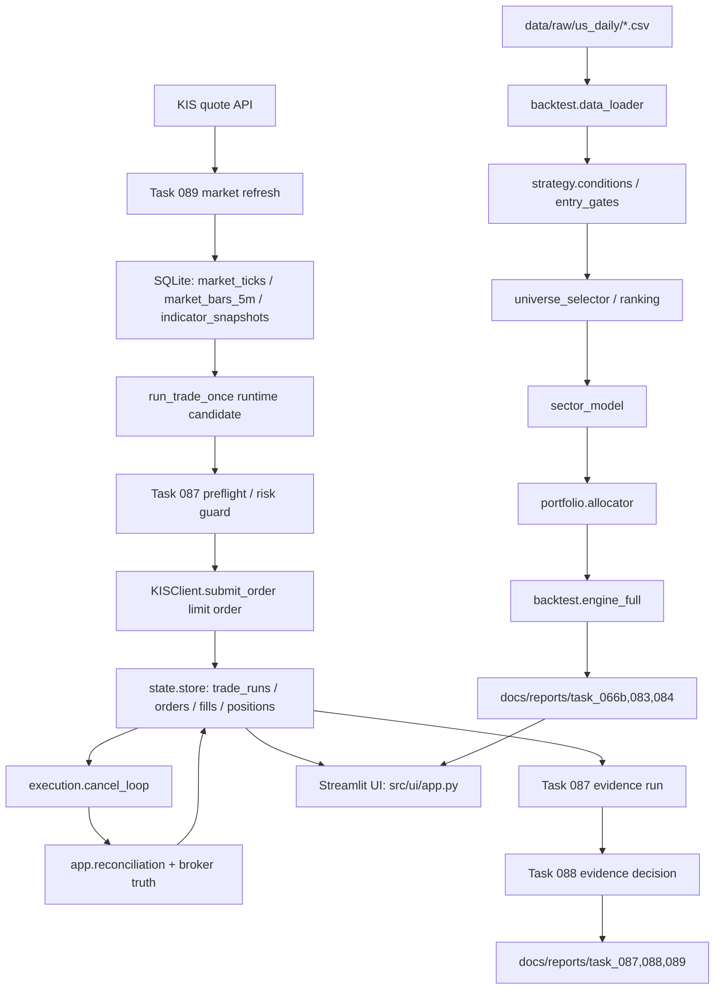

# 1. Executive Summary

- The project has a coherent research-to-paper architecture, but it is not live-ready.
- The strongest parts are the execution state contract, UNKNOWN halt, cancel/reconcile loop, evidence aggregation, and strategy-lock documentation.
- The weakest parts are real broker sample coverage, backtest/live signal alignment, capital-based portfolio interpretation, and production-grade scheduling/alerting.

Current project status: paper-pilot infrastructure is assembled and has begun collecting evidence. `docs/reports/task_088/task_088_evidence_summary.json` shows 9 Task 087 runs across 1 trading day, 5 reconciliation checks, 0 critical reconciliation events, but also 0 order attempts, 0 fills, 0 cancels, `MINIMUM_SAMPLE_NOT_MET`, `NO_ORDER_SAMPLE`, and `NO_CANCEL_SAMPLE`.

Overall verdict: **A. Ready for continued paper evidence accumulation**. This is not a live-readiness verdict. It means the current guardrails appear sufficient to keep collecting ultra-small paper evidence, while live pilot must remain blocked until real order/fill/cancel/reconcile samples and alignment tests exist.

# 2. System Map

Layer-by-layer:

- Data: static daily CSVs are loaded from `data/raw/us_daily`; runtime market data is stored in SQLite tables created by `src/app/task_089_market_data_signal_refresh.py`.
- Feature/strategy: `src/strategy/conditions.py` computes breakout and MA trend conditions; `src/backtest/entry_gates.py` adds entry gates.
- Universe/sector/portfolio: `src/universe/*`, `src/sector/sector_model.py`, and `src/portfolio/allocator.py` support ranking, sector mapping, and equal-weight allocation.
- Backtest: `src/backtest/engine_full.py` is the main daily-bar engine with pending entry/exit orders, fill stats, costs, slippage, risk policies, and portfolio mode.
- Execution: `src/app/run_trade_once.py` reads latest runtime signal, checks UNKNOWN/reconciliation/kill-switch guards, submits a KIS limit order, polls fills, cancels unresolved orders, and records state.
- State/reconciliation: `src/state/store.py` owns SQLite persistence; `src/app/reconciliation.py` and `src/execution/cancel_loop.py` enforce broker-truth reconciliation and UNKNOWN escalation.
- Evidence harness: Task 087 collects per-run evidence, Task 088 aggregates decisions, Task 089 refreshes quotes/signals, and `scripts/run_phase5_paper_loop.ps1` orchestrates intraday loops.
- UI: `src/ui/app.py` reads reports and SQLite state for research review and paper ops monitoring.

# 3. Audit Scorecard

| Area | Score | Rationale |
|---|---:|---|
| Architecture | 7 | Clear layers exist, but research, runtime signal, paper pilot, and task harness responsibilities overlap. |
| Backtest Reliability | 5 | Good cost scenarios and golden regression exist, but capital sizing, survivorship, and live-signal alignment remain unresolved. |
| Strategy Edge | 5 | D portfolio/sector filter is promising under S4, but sample is small and concentrated; current PnL is candidate evidence, not investable return. |
| Execution Safety | 7 | UNKNOWN halt, kill switch, reconciliation block, limit-order path, and late-fill handling exist; real broker samples are missing. |
| Realtime Data Pipeline | 5 | Task 089 creates useful 5m/tick/signal tables, but quote throttling caused partial evaluation and runtime signal equivalence is unproven. |
| Evidence Harness | 7 | Task 087/088 capture sample gates and warnings well; order/fill/cancel evidence is still empty. |
| UI/Operator Console | 6 | Streamlit reads DB and reports, but operator explanation for no-order/no-signal/risk-block states is not yet strong enough. |
| Testing | 7 | 22 Python tests plus KIS fixture tests and golden regression exist; real broker replay and alignment tests are missing. |
| Folder Convention | 6 | Main source layout is understandable; reports/artifacts are spread across many task folders and root `trading.db`. |
| Operational Readiness | 5 | Paper accumulation can continue, but scheduler, alerting, provenance, and real broker evidence gates are not production-ready. |

# 4. Findings by Severity

| id | severity | category | title | evidence file/function | why it matters | recommended action | suggested task id |
|---|---|---|---|---|---|---|---|
| F001 | HIGH | Execution Safety | No real order/fill/cancel sample yet | `trading.db` read-only counts: `orders=0`, `fills=0`, `position_events=0`; `docs/reports/task_088/task_088_evidence_summary.json` has `order_attempts=0`, `filled_orders=0`, `cancelled_orders=0` | Execution safety claims cannot be validated without real broker lifecycle samples. | Continue paper only until at least one real submitted, filled/partial, cancelled, and reconciled sample is captured. | T091 |
| F002 | HIGH | Realtime Data Pipeline | Runtime signals are not proven equivalent to backtest signals | `src/app/task_089_market_data_signal_refresh.py::_compute_row`; `src/app/run_trade_once.py::_load_runtime_candidate`; `src/backtest/engine_full.py::run_full_backtest_with_stats` | A live entry can be generated from 5m plus appended daily data while research logic is daily-bar based; mismatch can distort paper results. | Add a backtest/live signal alignment replay test over the same bars and selected symbols. | T092 |
| F003 | HIGH | Backtest Reliability | Backtest PnL is not capital-return evidence | `src/backtest/engine_full.py` uses `initial_equity`, `MAX_POSITION_WEIGHT`, and quantity sizing; `docs/reports/task_083/task_083_portfolio_validation.md` shows low `CapUtil`; `docs/reports/task_084/task_084_strategy_lock.md` reports NetPnL/PF | NetPnL and PF can look attractive while deployable return on actual capital remains unclear. | Build capital-based portfolio backtest reporting CAGR, exposure, cash, position sizing, and return on capital. | T093 |
| F004 | HIGH | Realtime Data Pipeline | KIS quote throttling causes partial symbol evaluation | `docs/reports/task_089/task_089_market_signal_refresh.json` evaluated 4/12 symbols and records eight `EGW00201` throttle failures | The top candidate list may be biased toward symbols queried before throttling. | Add quote throttling/backoff, per-symbol retry budget, and explicit degraded-universe status. | T094 |
| F005 | HIGH | Operational Readiness | Production scheduler and alerting are not sufficient | `scripts/run_phase5_paper_loop.ps1`; `src/app/run_trade_once.py::_send_recon_alert_if_enabled` only alerts reconciliation critical/error | A terminal PowerShell loop can run unattended poorly, and most degraded evidence states are not pushed to the operator. | Add a supervised scheduler, heartbeat, structured logs, and alerts for stale data, no-order streaks, throttle failures, and evidence FAIL. | T095 |
| F006 | MEDIUM | Harness | Task 087/088/089 responsibilities overlap and can obscure root cause | `scripts/run_phase5_paper_loop.ps1` runs 089 -> 087 -> 088; `src/app/task_087_pilot_evidence.py` also invokes task 085 and records external failures | A failure can be represented as dry-run evidence, step failure, warning, or aggregate warning, making triage slower. | Define a single run envelope schema with component status, broker status, signal status, and evidence status. | T096 |
| F007 | MEDIUM | Execution Safety | Live environment is blocked in Task 087 but `run_trade_once` has separate live gating semantics | `src/app/task_087_pilot_evidence.py::_preflight_failures` blocks non-paper env; `src/app/run_trade_once.py::_assert_trading_allowed` requires `control_state.run_mode=LIVE_ENABLED` | Paper/live separation exists, but two gates with different rules can confuse operators during live-pilot preparation. | Document and test the exact paper/live state machine and required env/control_state transitions. | T097 |
| F008 | MEDIUM | Backtest Reliability | Fixed 12-symbol universe and survivorship risk remain | `src/backtest/data_loader.py::DEFAULT_US_UNIVERSE`; `data/raw/us_daily/*.csv`; `docs/reports/task_083/task_083_portfolio_validation.md` | A handpicked surviving large-cap universe can overstate robustness. | Add dated universe snapshots or clearly label results as fixed-universe candidate research. | T098 |
| F009 | MEDIUM | Testing | KIS fixtures are synthetic contract samples, not broker proof | `tests/fixtures/kis/*.json`; `tests/test_kis_cancel_contract.py`; no non-empty `tests/replay` broker sample | Tests cover mapping paths but cannot replace real API behavior, latency, partial fills, and cancel race samples. | Capture sanitized real KIS order/fill/cancel/reconcile fixtures and replay them in tests. | T099 |
| F010 | MEDIUM | UI/Operator Console | UI does not yet make no-order/no-signal/root-cause decisions obvious enough | `src/ui/app.py`; `docs/reports/task_087/task_087_latest_run.json`; `docs/reports/task_088/task_088_evidence_summary.json` | Operators need to know why no order happened: no signal, stale data, throttle, missing credentials, risk block, duplicate, or market closed. | Add a Paper Ops decision panel with root-cause hierarchy and red/yellow risk states. | T100 |
| F011 | MEDIUM | Folder Convention | Artifacts and runtime DB are spread across task folders and project root | `docs/reports/task_066b` through `task_089`; `docs/audits`; root `trading.db`; `docs/tmp` | Investigation gets slower as evidence grows and root DB state is mixed with repo artifacts. | Adopt `data/runtime`, `docs/reports/tasks/task_xxx`, and retention/archive conventions. | T101 |
| F012 | MEDIUM | Performance | Evidence and report accumulation can become slower over time | `src/app/task_088_evidence_decision.py` scans all `docs/reports/task_087/runs/*.json`; `docs/reports/task_087/runs` currently has 9 JSON runs | A long paper pilot can turn aggregation and UI loading into an avoidable bottleneck. | Add rolling indexes, date partitions, and archive policy for evidence and logs. | T102 |
| F013 | LOW | Documentation | Strategy reports use confident labels that can create false confidence | `docs/reports/task_084/task_084_strategy_lock.md` says `answer_q1_real_money: YES`; `docs/reports/task_066b/task_066B_final_validation_time_stop_only.md` is WARNING | A reader can mistake research readiness for live trading readiness. | Rewrite strategy-lock language to distinguish candidate strategy, paper readiness, and live readiness. | T103 |
| F014 | LOW | Skills/Codex Workflow | Task granularity is useful but needs checkpoint discipline | `docs/reports/task_087`, `task_088`, `task_089`; `skills/subagent-artifact-governance/SKILL.md` | Long audit/implementation tasks need clear read-only, report-only, and checkpoint rules to avoid scope drift. | Use planner/executor/reviewer/tester roles for large tasks and require checkpoint summaries. | T104 |

# 5. What Is Good

- Execution state contract: `src/state/store.py` defines allowed run/order states, persistent trade runs, orders, fills, positions, position events, reconciliation runs, and reconciliation events.
- UNKNOWN halt: `src/app/run_trade_once.py` blocks when `has_order_with_status(..., status="UNKNOWN")`; `src/execution/cancel_loop.py` escalates timeout or unmapped broker states to `UNKNOWN`.
- Cancel/reconcile loop: `src/execution/cancel_loop.py::cancel_until_terminal` polls broker status, retries cancel requests, reconciles repeatedly, and handles late-fill callbacks.
- Broker truth principle: `src/app/run_trade_once.py::_run_reconciliation_check` records broker fetch errors as CRITICAL and blocks new orders when reconciliation says so.
- Market order guard: `src/app/task_087_pilot_evidence.py` locks `market_order_allowed=false`, and `src/integration/kis_client.py::submit_order` sends a positive limit price via `OVRS_ORD_UNPR`.
- Paper/live guard: Task 087 treats non-paper `KIS_ENVIRONMENT` as `LIVE_ENVIRONMENT_DETECTED`; `run_trade_once` also requires control-state permission through `_assert_trading_allowed`.
- Evidence loop: Task 087 captures per-run evidence, Task 088 enforces minimum sample criteria, and Task 089 produces market/signal diagnostics.
- Portfolio/sector filter improvement: `docs/reports/task_083/task_083_portfolio_validation.md` shows `D_PORTFOLIO_SECTOR_FILTER` improving PF and Sharpe versus baseline portfolio modes under S4.
- Strategy cost sensitivity: `docs/reports/task_084/task_084_strategy_lock.md` reports S1-S6 PF, NetPnL, MDD, Sharpe, trades, and fill rate.
- Tests/golden regression: 22 Python tests exist, including `tests/test_golden_s4_kis_realistic.py`, cancel-loop tests, KIS cancel contract tests, Task 087/088/089 tests, and PowerShell orchestration checks.

# 6. What Is Missing

- Capital-based portfolio backtest that reports investable return, cash, exposure, CAGR, and realistic position sizing.
- Backtest/live signal alignment test proving Task 089 and `run_trade_once` generate the same entry decisions as locked research logic.
- Sanitized real KIS fixture set from actual quote/order/fill/cancel/reconciliation responses.
- Real paper order/fill/cancel sample; current DB and Task 088 aggregate show no submitted, filled, partial, late-fill, or cancel samples.
- Production scheduler with heartbeat, restart policy, log retention, and failure notification.
- Alerting beyond reconciliation critical/error: stale data, throttle failures, no-order streak, evidence FAIL/WARNING, and unexpected live env should alert.
- Data provenance/versioning for CSV bars, quote snapshots, indicator snapshots, and strategy report inputs.
- Retention/archive policy for `docs/reports/task_087/runs`, logs, temporary files, and runtime SQLite backups.
- UI explanation path for "why no order happened" across no signal, market closed, stale data, missing credentials, throttle, duplicate intent, risk guard, and recon block.

# 7. False Confidence Risks

- PF-only confidence: `D_PORTFOLIO_SECTOR_FILTER` S4 PF 1.698872 is encouraging, but only 39 trades and concentrated XLK exposure make it a candidate, not a money-ready strategy.
- NetPnL-as-return confidence: `docs/reports/task_083` and `task_084` NetPnL values are not capital returns without a complete capital/position sizing framework.
- Paper WARNING confusion: Task 088 `WARNING` currently means minimum sample is not met, not necessarily system failure.
- No-signal confusion: Task 087 `NO_SIGNAL_OR_NO_ORDER_SAMPLE` and `run_trade_once` `SKIPPED_NO_SIGNAL` are valid states when no entry candidate exists.
- Synthetic fixture confidence: `tests/fixtures/kis/*.json` validate code paths but do not prove real broker behavior.
- One-day evidence confidence: 9 runs across 1 trading day cannot validate fill rate, slippage drift, cancel success, or late-fill behavior.
- Partial evaluation confidence: Task 089 produced 2 enter candidates while evaluating only 4 of 12 symbols due to KIS throttling; selected candidates may be biased.
- Strategy-lock wording confidence: labels like `answer_q1_real_money: YES` can be misread as live readiness despite missing real broker samples.

# 8. Recommended Roadmap

Next 3 tasks:

1. T091 - Paper lifecycle sample capture gate: collect and validate real paper order, fill/partial, cancel, and reconciliation samples with sanitized fixtures.
2. T092 - Backtest/live signal alignment: replay locked strategy inputs through Task 089/runtime selection and compare against backtest decisions.
3. T094 - KIS quote throttling hardening: add pacing, retry/backoff, degraded-universe status, and evidence fields for skipped symbols.

Next 7 days:

- Accumulate at least 5 trading days, 10 order attempts, 5 fills, 1 cancel, 5 EOD reviews, and 5 reconciliation checks as already defined in Task 088.
- Add UI root-cause panels for no-order/no-signal/risk-block/stale-data/throttle states.
- Capture sanitized real KIS responses and add replay tests.
- Partition evidence files by date and add an evidence index to avoid full-directory scans.

Before live pilot:

- Complete T091, T092, T093, T094, and T100.
- Verify no UNKNOWN orders, no reconciliation CRITICAL, no unresolved late fills, no broker/local position mismatch, and no market-order path.
- Run a live-pilot dry-run checklist proving env separation, kill switch, emergency cancel, alerting, and rollback steps.
- Rewrite strategy report labels to say "paper candidate" until real-money gates are satisfied.

Before scaling:

- Add capital-based portfolio simulation with account currency, FX assumptions, cash, exposure, and position sizing.
- Add production scheduler, heartbeat, alert routing, log retention, DB backup, and evidence archival.
- Expand universe methodology beyond fixed 12 symbols or explicitly version fixed-universe research.
- Monitor rolling live/paper fill rate, slippage drift, PF, MDD, stale-data ratio, and throttle rate.

# 9. Proposed Task List

| task id | title | objective | scope | non-goals | acceptance criteria |
|---|---|---|---|---|---|
| T091 | Paper Broker Lifecycle Evidence Gate | Prove real paper order lifecycle safety before live pilot | Capture submitted, filled/partial, cancelled, late-fill/reconcile if available; sanitize fixtures; update evidence gates | Strategy changes; parameter tuning; live orders | Task 088 shows minimum lifecycle samples met, sanitized fixtures exist, replay tests pass |
| T092 | Backtest/Runtime Signal Alignment | Prove runtime signals match locked research signals | Replay same symbol/date bars through backtest condition logic and Task 089/runtime selection | New alpha; UI redesign | Alignment report has zero unexplained mismatches for locked strategy sample |
| T093 | Capital-Based Portfolio Backtest | Convert candidate PnL into investable return metrics | Cash, exposure, position sizing, CAGR/return, drawdown on equity, capital utilization | Broker integration | Report distinguishes trade PnL, capital return, and deployment assumptions |
| T094 | KIS Quote Throttle Hardening | Prevent biased candidate selection under quote throttling | Request pacing, retry/backoff, skipped-symbol evidence, degraded-universe status | Order execution changes | Task 089 evaluates all configured symbols or marks run degraded with explicit skipped symbols |
| T095 | Production Scheduler and Alerting | Make paper loop operationally supervised | Scheduler, heartbeat, alert events, structured logs, restart/stop policy | Cloud deployment; live trading | Operator receives alerts for stale data, throttle, evidence FAIL, recon critical, and loop crash |
| T096 | Unified Run Envelope Schema | Simplify Task 087/088/089 root-cause triage | Component statuses, signal status, broker status, evidence status, failure hierarchy | Trading logic changes | One JSON schema explains every run without reading multiple task files |
| T097 | Paper/Live State Machine Contract | Remove ambiguity in env and control-state gates | Document/test KIS env, control_state, kill switch, emergency cancel, live pilot transitions | Credential rotation | Tests prove paper blocked from live endpoints and live requires explicit control-state setup |
| T098 | Universe Provenance | Reduce survivorship/fixed-universe ambiguity | Version universe snapshots and data source metadata | New selection alpha | Reports state exact universe/date/data version used |
| T099 | Real KIS Replay Fixtures | Replace synthetic-only confidence with real samples | Sanitized quote/order/fill/cancel/status fixtures and replay tests | New broker support | Tests replay real paper responses without secrets |
| T100 | Paper Ops Decision UI | Let operator answer "why no order?" quickly | UI panels for signal, data freshness, risk guard, credentials, throttle, duplicate, recon | Strategy tuning | UI displays root cause and severity for latest run within one screen |

# 10. Final Verdict

**A. Ready for continued paper evidence accumulation**

The project should continue collecting paper evidence because the current code contains meaningful protective controls: UNKNOWN-order halt, reconciliation critical block, kill switch checks, limit-order execution path, duplicate-intent checks, late-fill correction hooks, and Task 087/088 evidence gates.

It is **not** ready for live trading. The blocking reasons are concrete: zero real order/fill/cancel samples in the current DB/evidence, unproven backtest/live signal alignment, KIS quote throttling causing partial symbol evaluation, and missing production scheduler/alerting. Continue paper runs, but keep live pilot blocked until the HIGH findings are closed.
