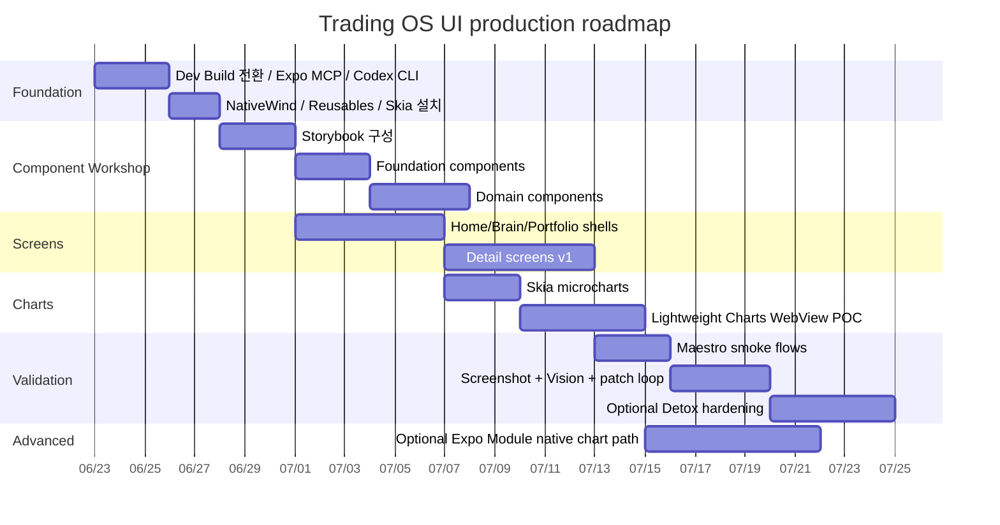

# Production UI Toolchain Reference for the Read-only Trader Brain Frontend

> 참고 상태: 이 문서는 최신 운영 상태가 아니라 프론트엔드 도구체인과 워크플로우를 잡기 위한 참고 자료입니다. 현재 프로젝트 권한과 SSOT는 `docs/operating_system/project_operating_state.md`, `docs/frontend_app_ssot/`, task reports, validator output을 우선합니다.

## Executive summary

가장 현실적인 결론은 **Expo Go를 즉시 졸업하고, Expo Development Build 기반으로 개발 체인을 재구성**하는 것입니다. Expo 자체가 Development Build를 “자신만의 Expo Go”로 설명하며, 여기서는 임의의 네이티브 라이브러리와 네이티브 설정 변경이 가능하다고 명시합니다. 반대로 Expo Go는 공식적으로 “learning environment and sandbox”라고 안내합니다. 지금 겪고 있는 “자유도가 낮아서 결과물이 투박해지는 문제”는 도구를 잘못 고른 문제가 아니라, **Expo Go의 목적 자체가 빠른 샌드박스이기 때문**입니다. citeturn26view4turn37search5turn26view5

당장 추천하는 상위 워크플로우는 다섯 가지입니다.
첫째, **주 스택은 Expo Development Build + Expo Router + TypeScript + NativeWind + React Native Reusables + Skia + Codex CLI + Expo MCP + Maestro**로 갑니다. 이 조합이 현재 조건인 모바일 우선, iOS 타깃, 예쁜 UI, Codex 자동화, 네이티브 확장 가능성의 균형이 가장 좋습니다. Expo Router는 파일 기반 라우팅과 딥링킹을 제공하고, NativeWind는 Expo에서의 설치 및 Metro 통합 경로가 정리되어 있으며, React Native Reusables는 NativeWind 기반의 예쁜 재사용 컴포넌트를 제공합니다. Expo Skills와 Expo MCP는 Codex/에이전트가 Expo 문맥을 이해하고 시뮬레이터 상호작용·스크린샷·디버깅을 하도록 도와줍니다. citeturn29view1turn37search0turn28view4turn26view1turn26view2turn32view0

둘째, **차트는 하나의 전략으로 통일하지 말고 이원화**해야 합니다. 전체 앱의 UI 카드, 마이크로 차트, 스파크라인, 강조 애니메이션은 **Skia**로 처리하고, 실제 캔들/크로스헤어/줌/팬/실시간 스트리밍이 중요한 메인 금융 차트는 **TradingView Lightweight Charts를 WebView “chart island”로 임베드**하는 것이 가장 현실적입니다. TradingView Lightweight Charts는 HTML5 Canvas 기반, 실시간 스트리밍, Apache 2.0 오픈소스이고, 공식 iOS/Android 래퍼도 본질적으로 WebView 렌더링 경로를 사용합니다. 즉, “TradingView급 차트”를 React Native에서 가장 실용적으로 가져오는 방법은 처음부터 WebView 섬으로 생각하는 쪽입니다. citeturn29view4turn29view5turn29view6turn27view11turn27view4

셋째, **디자인 툴의 핵심은 Figma가 아니라 컴포넌트 워크숍 + 스크린샷 루프**로 바꾸는 것이 좋습니다. 무료 Figma는 Codex-MCP와의 결과 품질 편차가 크고, 현재 상황에서는 오히려 `Storybook for React Native`가 더 직접적으로 도움이 됩니다. Storybook은 UI를 격리해 개발·문서화·테스트하는 “workshop”이며, React Native용 Storybook은 Expo 템플릿과 Expo Router 셋업 가이드를 제공하고, Agent skills까지 포함합니다. 돈을 쓰지 않고도 “컴포넌트-우선” 설계를 Codex와 결합할 수 있습니다. citeturn34view1turn34view2

넷째, **Vision + screenshot + patch 루프는 진짜로 유효**합니다. 다만 “디자인 생성 엔진”이 아니라 “검수·수정 루프”로 써야 합니다. Codex CLI는 공식적으로 이미지 입력, 이미지 생성, `exec` 기반 스크립팅, MCP를 지원합니다. Expo MCP도 시뮬레이터 스크린샷과 UI 상호작용 검증을 지원합니다. 따라서 “시뮬레이터에서 스크린샷 캡처 → Vision 리뷰 프롬프트 → 패치 → 재실행”이 Figma 없이도 돌아가는 현실적인 루프입니다. citeturn32view0turn26view2

다섯째, **Detox는 바로 주력으로 쓰지 말고 Maestro를 먼저 도입**하는 편이 낫습니다. Maestro는 YAML 플로우 기반, 빠른 로컬 실행, Expo 앱 예제가 풍부하고, MCP까지 갖추고 있습니다. Detox는 React Native용으로 매우 성숙했고 New Architecture와의 공식 호환 범위도 명시돼 있지만, 설정·CI·속도 측면에서 무겁다는 커뮤니티 경험도 적지 않습니다. 즉, 지금 단계에서는 Maestro로 스모크/시각검증 루프를 돌리고, 정말 정교한 gray-box E2E가 필요할 때만 Detox를 추가하는 것이 좋습니다. citeturn27view12turn29view8turn31search6turn31search18turn27view13turn31search19

## 권장 워크플로우와 최적 도구체인

당신의 제약 조건을 다시 정리하면 이렇습니다.
앱은 모바일 퍼스트, iOS 우선, 복잡한 트레이딩 도메인, 설명 가능한 판단형 UI, 라이트 테마, 높은 가독성, TradingView급 차트, Codex 중심 자동화, 그리고 최소한의 유료 디자인 툴 선호입니다. 이 조건에서는 **“웹 디자이너식 목업 중심”보다 “실기기/시뮬레이터 중심의 컴포넌트-우선 구현”**이 훨씬 낫습니다. Expo 공식 문서도 Development Build, MCP, Skills, Router, New Architecture 전반이 이 방향을 밀어주고 있습니다. citeturn26view4turn26view2turn26view1turn29view1turn26view5

가장 추천하는 기본 스택은 다음과 같습니다.

| 레이어 | 추천 | 이유 |
|---|---|---|
| 앱 런타임 | **Expo Development Build** | 임의 네이티브 라이브러리와 네이티브 설정 변경 가능. Expo Go는 샌드박스 성격. citeturn26view4turn37search5 |
| 라우팅 | **Expo Router + TypeScript** | 파일 기반, 딥링크 가능, 모바일/웹 공통 구조에 유리. citeturn29view1 |
| 스타일링 | **NativeWind** | Tailwind식 생산성과 Expo 통합 경로가 좋음. Metro/Babel 설정 공식화. citeturn37search0turn37search18 |
| 컴포넌트 베이스 | **React Native Reusables** | shadcn/ui 감성의 예쁜 컴포넌트를 NativeWind 기반으로 재사용 가능. citeturn28view4 |
| 렌더링/모션 | **Skia + Reanimated + Gesture Handler** | UI thread 애니메이션, 고성능 2D 그래픽, 결정적 제스처 처리. citeturn27view4turn29view2turn29view3 |
| 메인 금융 차트 | **Lightweight Charts in React Native WebView** | 공식 Lightweight Charts 자체가 WebView 래퍼 경로를 제공. RN에서 실용적인 최단 경로. citeturn29view4turn29view5turn29view6turn27view11 |
| 컴포넌트 워크숍 | **Storybook for React Native** | 무료, 격리 개발, 문서화, 시각 테스트, AI agent adoption에 유리. citeturn34view1turn34view2 |
| 에이전트/자동화 | **Codex CLI + Expo Skills + Expo MCP** | 로컬 코드 수정, 이미지 입력, 스크립팅, 시뮬레이터 자동 검증. citeturn32view0turn26view1turn26view2turn28view2 |
| E2E/시각 루프 | **Maestro 우선, Detox 보조** | Maestro는 빠른 시작과 Expo 사례가 좋고, Detox는 더 무겁지만 성숙함. citeturn27view12turn29view8turn27view13turn40view0 |

이 조합이 좋은 핵심 이유는 **“예쁜 UI를 빠르게 돌려보면서, 필요 시 네이티브로 내려갈 수 있는 사다리”**를 제공하기 때문입니다. Expo는 SDK 55+에서 New Architecture만 지원하고, Expo Modules API로 작성한 네이티브 모듈은 New Architecture를 기본 지원합니다. 즉, 먼저 Expo Dev Build로 생산성을 확보한 뒤, 차트 같은 부분만 Expo Module로 내리는 진화 경로가 열려 있습니다. citeturn26view5

## Prioritized toolchain options

아래 옵션들은 “좋고 나쁨”이 아니라 **지금 시점에 무엇을 먼저 선택하는 게 경제적인가**를 기준으로 정렬했습니다.

| 우선순위 | 옵션 | 장점 | 단점 | 성숙도 / Codex 친화성 | 최종 판단 |
|---|---|---|---|---|---|
| 최고 | **Expo Dev Build + NativeWind + Reusables + Skia + WebView chart island** | 구현 속도, 모바일 UI 품질, Codex 자동화, 네이티브 확장성의 균형이 가장 좋음. Expo MCP/Skills 연동도 강함. citeturn26view4turn26view1turn26view2turn37search0turn28view4turn27view4 | WebView chart island와 RN UI 사이 브리징 설계가 필요 | 성숙도 높음 / Codex 친화성 매우 높음 | **지금 바로 채택** |
| 높음 | **위 스택 + Storybook for React Native** | 컴포넌트 카탈로그 단계와 찰떡. 디자인 시스템·도메인 컴포넌트 개발에 최적. 무료. citeturn34view1turn34view2 | 초기 셋업이 소폭 추가됨 | 성숙도 높음 / Codex 친화성 높음 | **병행 채택 권장** |
| 중상 | **Expo Dev Build + Expo Module로 Lightweight Charts iOS/Android 공식 래퍼 브리지** | WebView를 감싼 chart island보다 더 통제된 네이티브 패키징 가능. 장기적으로 깔끔함. citeturn27view9turn27view10turn26view5 | 초기 구현비용 큼. 공식 docs와 repo 버전 표기가 일부 어긋남. 먼저 검증 필요. citeturn29view5turn29view6turn27view9turn27view10 | 성숙도 중간 / Codex 친화성 중간 | **차트가 핵심 차별점이 되면 2단계에서** |
| 중간 | **Expo Dev Build + 전면 Skia 커스텀 차트** | 완전한 네이티브 feel, 브랜딩/모션 자유도 최고. UI thread 위주라 부드러움. citeturn27view4turn29view2turn29view3 | TradingView급 도구/스터디/가격축/교차선 전체를 직접 다시 만들어야 함 | 성숙도는 엔진 높음 / 제품화 난이도 높음 | **마이크로 차트 전용으로만 추천** |
| 낮음 | **Bare React Native로 즉시 이동** | 가장 큰 자유도 | 지금 단계에서 생산성을 크게 잃고, Codex·Expo 자동화 이점도 감소 | 성숙하나 운영 비용 큼 | **당장은 비추천** |

핵심은 이렇습니다.
**앱 전체를 네이티브 로우레벨로 만들지 말고, 차트만 별도의 고성능 섬으로 다뤄라**는 것입니다. 일반 화면은 NativeWind/Skia/Reusables 조합으로 충분히 예쁘고 빠르게 만들 수 있고, 진짜 까다로운 금융 차트만 Lightweight Charts 쪽으로 분리하는 접근이 가장 효율적입니다. citeturn28view4turn27view4turn29view4turn29view5turn29view6

## OSS examples and concrete repos

이 섹션은 “바로 복붙해서 레퍼런스로 열어볼 저장소” 중심입니다. 링크는 각 인용을 누르면 됩니다.

### Expo dev-build / app templates

가장 실전적인 시작점은 `create-expo-app` 기본 템플릿이 아니라, **NativeWind/Expo Router/dev-client가 이미 들어간 템플릿**입니다. `roninoss/create-expo-stack`은 Expo Router, TypeScript, NativeWind, Unistyles, Firebase/Supabase 옵션까지 고를 수 있는 CLI입니다. `Teczer/fast-expo-app`은 Expo Router, NativeWind, MMKV, React Query, Zustand, expo-dev-client까지 묶인 보일러플레이트라서 “트레이딩 앱 셸”을 빠르게 만들기에 현실적입니다. `kimchouard/expo-router-nativewind-skia-template`은 NativeWind와 Skia를 동시에 얹은 예시라서 시각 품질 검증에 좋습니다. citeturn28view6turn28view5turn28view7

추천 저장소:
- `roninoss/create-expo-stack` citeturn28view6
- `Teczer/fast-expo-app` citeturn28view5
- `kimchouard/expo-router-nativewind-skia-template` citeturn28view7

### NativeWind / design-system friendly UI

`NativeWind` 공식 문서는 Expo 설치 경로에서 Babel preset, Metro 래퍼, `global.css` 입력 구성을 분명히 제시합니다. 여기에 `founded-labs/react-native-reusables`를 결합하면 “가독성 높은 라이트 UI + 예쁜 기본 컴포넌트”를 빠르게 만들 수 있습니다. 특히 RN Reusables는 shadcn/ui 감성의 재사용 컴포넌트를 RN/Expo 쪽으로 가져온다는 점에서, 당신이 원하는 “대표 화면이 예뻐서 자꾸 열게 되는 앱”에 가장 잘 맞습니다. citeturn37search0turn28view4

추천 저장소:
- `founded-labs/react-native-reusables` citeturn28view4
- `NativeWind` 공식 docs / repo entrypoints citeturn37search0turn37search18

### Skia / graphics / micro charts

Skia는 카드 내부 마이크로 차트, 곡선 애니메이션, 배경 하이라이트, 도메인 배지 시각화에 특히 잘 맞습니다. `Shopify/react-native-skia`는 가장 중요한 엔진 레벨 선택이고, `margelo/react-native-graph`는 line graph 위주의 가벼운 스파크라인 레퍼런스에 좋습니다. 최근 커뮤니티 실험으로는 `Tony-Starkus/react-native-financial-charts`가 캔들·터치 정밀도·60/120fps를 지향하지만 아직 스타·생태계·운영 사례는 작아서 주력 의존성으로는 신중해야 합니다. citeturn27view4turn27view6turn27view7turn36view2

추천 저장소:
- `Shopify/react-native-skia` citeturn27view4
- `margelo/react-native-graph` citeturn27view6turn36view1
- `Tony-Starkus/react-native-financial-charts` citeturn27view7turn36view2

### TradingView-level finance charts

여기서 가장 중요한 현실 체크가 있습니다.
`Lightweight Charts`는 공식적으로 HTML5 Canvas 기반의 오픈소스 차트 라이브러리이고, iOS/Android wrapper 문서도 **WebView 안에서 렌더링되는 래퍼**라는 설명을 제공합니다. 다시 말해, RN에서 “순수 네이티브 뷰처럼 쓰고 싶다”는 기대를 버리고, 애초에 **차트 섬(WebView/브리지)** 으로 설계하는 게 맞습니다. React Native WebView는 커뮤니티 유지보수의 표준 WebView입니다. citeturn29view4turn29view5turn29view6turn27view11

추천 저장소:
- `tradingview/lightweight-charts` 공식 라이브러리 진입점 citeturn29view4
- `tradingview/LightweightChartsIOS` citeturn27view9
- `tradingview/lightweight-charts-android` citeturn27view10
- `react-native-webview/react-native-webview` citeturn27view11
- 보조 후보: `coinjar/react-native-wagmi-charts`는 단순 캔들/라인/툴팁엔 쓸 수 있으나, 이슈 수 기준으로도 장기 주력보다는 보조 후보에 가깝습니다. citeturn27view8turn36view0

### Storybook / component workshop

Figma 대신 가장 실용적인 무료 대안은 Storybook입니다. Storybook은 컴포넌트/페이지를 격리 개발하는 워크숍이고, RN Storybook은 Expo 템플릿, Expo Router 셋업, on-device addons, 그리고 agent skills까지 제공합니다. 즉, “Component Catalog → 실제 구현”을 연결하는 허브로 쓰기 좋습니다. citeturn34view1turn34view2

추천 저장소:
- `storybookjs/react-native` citeturn34view2
- `Storybook` 공식 사이트 / docs citeturn34view1
- `expo-template-storybook` 경로는 RN Storybook repo에서 안내됨 citeturn34view2

### Screenshot-to-vision / image-gen inspiration

스크린샷으로부터 곧바로 React Native 코드를 잘 뽑는 오픈소스는 아직 “영감” 수준에 가깝습니다. `abi/screenshot-to-code`는 HTML/Tailwind/React/Vue/Ionic 등 웹 중심 변환을 잘 보여주는 흥미로운 예제이지만, RN/Expo 프로덕션 UI의 정답은 아닙니다. 반면 디자인 무드 탐색용으로는 `ComfyUI`, `InvokeAI`, `wandb/openui` 같은 오픈소스가 더 적합합니다. 다만 이들은 **직접 프로덕션 코드로 이어지기보다 레퍼런스·무드보드·대안 탐색**에 쓰는 것이 맞습니다. citeturn27view14turn27view15turn27view16turn25search14

추천 저장소:
- `abi/screenshot-to-code` citeturn27view14
- `Comfy-Org/ComfyUI` citeturn27view15
- `invoke-ai/InvokeAI` citeturn27view16
- `wandb/openui` / OpenUI 계열 citeturn25search14turn25search10

### Codex / agent integration

Codex 쪽은 오히려 지금이 가장 좋은 시기입니다. Codex CLI는 로컬에서 코드 읽기·수정·실행·이미지 입력·이미지 생성·스크립팅·MCP를 지원합니다. Expo는 공식적으로 Skills와 MCP를 제공해 Codex 같은 에이전트가 Expo SDK, 권장 패키지, 시뮬레이터, DevTools를 더 정확히 다루게 합니다. 이 조합은 “스마트한 자동 구현 보조” 관점에서 Figma보다 직접적인 가치가 큽니다. citeturn32view0turn28view2turn26view1turn26view2turn28view0

추천 저장소 / docs:
- `openai/codex` citeturn40view3
- `expo/skills` citeturn28view1turn28view0
- Expo MCP docs citeturn26view2

### E2E / screenshot / CI references

Maestro는 Expo 앱 예제가 많고, GitHub Actions/EAS 연동 예제도 쉽게 찾을 수 있습니다. Detox는 스크린샷·요소 스냅샷까지 지원하고 RN 대상으로 매우 성숙하지만 무겁습니다. 현 단계에서는 Maestro를 먼저 들이고, 나중에 Detox를 더하는 하이브리드가 현실적입니다. Argos는 오픈소스 core와 유료 SaaS가 공존하므로, solo 단계에서는 선택적입니다. citeturn27view12turn29view8turn31search6turn31search18turn29view7turn40view0turn38view0turn38view1

추천 저장소:
- `mobile-dev-inc/maestro` citeturn40view2
- `alexanderhodes/react-native-expo-maestro-example` citeturn31search6
- `lingvano/react-native-eas-maestro` citeturn31search18
- `wix/Detox` citeturn40view0
- `argos-ci/argos` citeturn38view0

## Reddit and community findings

Reddit와 블로그를 합쳐 보면, **Expo 자체는 이제 “간단한 앱만용”이 아니라 대부분의 RN 앱의 기본 출발점**으로 받아들여지고 있습니다. 특히 “정말 필요한 커스텀 네이티브 모듈이 없으면 Expo로 시작하라”는 취지의 의견이 반복되고, 필요 시 Development Build/EAS로 내려가는 경로를 추천하는 경우가 많았습니다. 이 방향은 Expo 공식 문서의 Development Build 철학과도 일치합니다. citeturn26view4turn4search0turn4search17turn37search5

차트 영역에서는 커뮤니티가 **Skia를 예쁜 그래프·애니메이션 엔진으로는 높게 평가하지만, TradingView급 금융 차트를 “전부 Skia로 직접 만드는 것”은 비용이 크다**고 보는 흐름이 강합니다. 공식 Lightweight Charts가 여전히 WebView 렌더링 경로를 중심으로 제공된다는 점도 커뮤니티가 RN 쪽에서 WebView/브리지 접근을 택하는 이유를 뒷받침합니다. citeturn27view4turn27view6turn29view5turn29view6

E2E 도구 선택에서는 **Maestro가 빠르고 진입장벽이 낮다**, **Detox는 더 강력하지만 무겁다**는 공감대가 분명했습니다. 공개 글들에서도 Expo + Maestro + GitHub Actions/EAS 조합 예시가 잘 보이고, 반대로 Detox는 GitHub Actions에서 느리거나 불안정해 로컬로 옮긴 사례도 있었습니다. 그러므로 UI 바이브코딩/시각 루프의 첫 번째 검증 도구로는 Maestro가 더 자연스럽습니다. citeturn31search10turn31search22turn31search18turn31search19turn27view13

마지막으로 “디자인 툴”에 대해서는 커뮤니티와 생태계 전반이 **Figma 자체보다 ‘실제 실행되는 UI를 캡처하고, 반복 검토하고, 컴포넌트로 분해하는 흐름’** 쪽으로 기울고 있습니다. Storybook, screenshot review, visual regression, Codex image input 같은 도구가 이 흐름을 잘 받쳐 줍니다. Codex와 Figma를 연결하는 공식 경로가 생기긴 했지만, 현재 당신의 예산/선호를 고려하면 **Figma는 필수가 아니라 옵션**입니다. citeturn34view1turn34view2turn32view2turn32view0

## Implementation roadmap

### 단계별 실행 계획

아래는 가장 실행 가능성이 높고, 되돌리기 쉬운 순서입니다.

| 단계 | 기간 | 핵심 결과물 | 주요 리스크 | 완화책 |
|---|---:|---|---|---|
| 부트스트랩 | 2~3일 | Expo Development Build 전환, Expo Router, TypeScript, NativeWind, Reusables, Skia, Expo MCP, Codex CLI 설치 | Expo Go 사고방식에서 못 벗어남 | Dev Build를 기본 실행환경으로 강제. Expo Go는 실험용만 유지. citeturn26view4turn37search5 |
| 컴포넌트 워크숍 | 3~5일 | Storybook 구성, foundation/domain component story 작성 | 앱 안에서 바로 만들다 보면 중복 컴포넌트가 생김 | 버튼/카드/배지/도메인 위젯은 Storybook first 원칙. citeturn34view2turn34view1 |
| 대표 화면 셸 | 4~6일 | Home, Brain, Portfolio 상위 정보구조를 실제 UI로 구현 | density 과잉, 카드 남발 | “above the fold 3카드” 규칙과 light/readability 기준 유지 |
| 차트 레이어 | 5~8일 | Skia 마이크로 차트 + Lightweight Charts WebView POC | WebView 브리지 복잡도 | 메인 차트만 island로 분리하고, 나머지는 Skia로 해결. citeturn29view4turn27view11turn27view4 |
| 시각 루프 자동화 | 2~4일 | Maestro 플로우, screenshot artifact, Codex vision prompt 루프 | 스크린샷 기준 일관성 부족 | iOS Simulator status bar 고정, 동일 기기 presets 사용. citeturn29view8turn39search0turn29view7 |
| 안정화 | 1~2주 | visual regression 기준, 성능 튜닝, 필요시 Detox 보강 | CI 불안정, flaky tests | Maestro smoke + selective Detox 조합 사용. citeturn31search19turn27view13 |
| 고급 차트 확장 | 선택 | Expo Module로 native chart wrapper 실험 | 공식 wrapper 정보 불일치 | iOS/Android wrapper 버전과 WebView 제약을 먼저 검증. citeturn29view5turn29view6turn27view9turn27view10 |

### 권장 타임라인



이 일정의 핵심은 **“대표 화면과 도메인 컴포넌트를 먼저 예쁘게 고정하고, 메인 차트는 후속 섬으로 붙인다”**입니다. 차트까지 한 번에 풀스택으로 완성하려고 하면 UI 품질보다 인프라 복잡도가 앞서 나갑니다. citeturn27view4turn29view4turn34view2

## Codex prompts, vision review loops, and recommended CI/dev workflow

### 가장 추천하는 개발 루프

가장 권장하는 루프는 다음과 같습니다.

1. Codex에게 특정 화면/컴포넌트를 구현시킨다.
2. Expo Development Build로 iOS Simulator에서 실행한다.
3. Maestro 또는 Detox로 해당 화면까지 자동 이동한다.
4. 스크린샷을 캡처한다. Detox는 device-level/element-level screenshot과 snapshot-test 개념을 공식 지원하고, iOS Simulator 쪽은 Xcode/Device Hub 또는 `simctl` 기반 캡처가 가능하다. citeturn29view7turn39search0turn39search2
5. 그 이미지를 Codex CLI에 다시 넣어 “디자인 QA” 프롬프트로 평가시킨다. Codex CLI는 공식적으로 image inputs와 scripting을 지원한다. citeturn32view0
6. Codex가 patch를 생성하고, 재실행한다.
7. 합격한 화면만 baseline으로 보관한다.

이 방식이 좋은 이유는, Figma의 “추상 캔버스” 대신 **실제 렌더링 결과물**을 기준으로 판단하기 때문입니다. 특히 모바일 트레이딩 앱은 타이포 밀도, 스와이프 감, 스크롤 리듬, safe area, 차트 가독성이 중요해서 실행 결과 기준 검증이 훨씬 낫습니다. citeturn26view2turn32view0turn34view1

### Codex 구현 프롬프트 예시

```text
Implement the Home screen in Expo React Native using:
- Expo Router
- TypeScript
- NativeWind
- React Native Reusables
- light UI only
- high readability over density
- premium visual hierarchy

Constraints:
- above the fold: 3 cards maximum
- cards must feel Apple Stocks / Toss / Linear inspired
- no table-first layout
- use summary cards for Portfolio Snapshot, Brain Snapshot, Attention Queue
- keep spacing generous
- target iPhone 15 Pro dimensions first
- produce reusable components only
- no business logic in UI
- use mock data
- output:
  1) component tree
  2) screen implementation
  3) notes on reusable parts extracted
```

이 프롬프트는 당신이 이미 확정한 IA/디자인 시스템/컴포넌트 카탈로그를 “재설계”하지 않고 구현에만 집중하도록 만드는 형태입니다. NativeWind와 Reusables를 함께 명시하면 Codex가 스타일/컴포넌트 계층을 더 안정적으로 잡는 편입니다. citeturn28view4turn37search0turn32view0

### Vision 리뷰 프롬프트 예시

```text
Review this iOS simulator screenshot as a senior mobile product designer.

Context:
- Trading Operating System
- Light UI preferred
- readability over density
- beautiful screens over enterprise dashboard aesthetics
- institutional reasoning, consumer clarity

Evaluate:
1. visual hierarchy
2. readability
3. fold priority
4. card density
5. chart clarity
6. premium feel
7. trustworthiness
8. whether the screen feels like work

Return:
- pass/fail
- 5 specific defects
- 5 specific UI changes
- severity for each issue
- exact components likely responsible
- a patch plan in implementation order
```

OpenAI의 이미지/비전 가이드는 이미지 입력 분석과 이미지 생성/편집을 모두 공식 지원합니다. 따라서 리뷰와 영감 생성 둘 다 같은 멀티모달 루프 안에 둘 수 있습니다. citeturn29view9turn29view10

### Design-mood 이미지 생성 프롬프트 예시

```text
Generate 4 mobile UI concept images for a premium light-theme trading operating system.
Tone:
- Apple Stocks readability
- Toss usability
- Linear sharpness
- Perplexity information organization

Do not:
- use dark terminal aesthetics
- use dense tables
- use more than 3 primary cards above the fold
- use neon finance dashboard tropes

Focus:
- white / warm-neutral surfaces
- clear typography
- compact but breathable cards
- institutional trust without enterprise ugliness
- chart areas that feel elegant
```

이건 코드 생성용이 아니라 **비주얼 무드 탐색**용입니다. 프로덕션 코드로 직결하지 말고, 카드 비율·여백·컬러 온도·계층만 추출하는 데 써야 합니다. ComfyUI/InvokeAI 같은 OSS 이미지 도구는 이 무드 탐색 단계에 적합합니다. citeturn27view15turn27view16turn29view10

### 권장 CI / dev workflow

가장 추천하는 CI 흐름은 “자동 수정”보다 “자동 검증 + 아티팩트 제공”입니다.

로컬 개발 흐름:
- `codex` 또는 `codex exec`로 구현
- `expo run:ios` 또는 dev build 실행
- Maestro flow로 화면 진입
- 시뮬레이터 스크린샷 캡처
- Codex vision 리뷰
- patch 적용
- 재검증 citeturn32view0turn29view8turn26view4

CI 흐름:
- macOS runner에서 iOS simulator build
- Maestro smoke flow 수행
- 주요 화면 screenshot artifact 업로드
- Storybook 또는 스냅샷 baseline 비교
- PR 코멘트에 “깨진 화면 / diff 경로 / 재현 플로우” 출력
- **초기에는 CI가 자동으로 코드를 푸시하지 않도록 유지**
이유는, 지금 단계에서 가장 비싼 실수는 자동 패치가 아니라 잘못된 비주얼 기준의 고착화이기 때문입니다. Codex docs는 scripting, GitHub Action, skills, MCP까지 열어두고 있지만, 실제 팀 생산성은 “로컬에서 강하게, CI에서는 보수적으로” 운영할 때 가장 좋습니다. citeturn32view0turn32view1turn31search14

## Licensing, compatibility, paid alternatives, and open questions

라이선스와 호환성 면에서는 대부분 다루기 좋은 편입니다.
`react-native-skia`, `react-native-webview`, `react-native-reusables`, `Detox`, `Argos core`는 MIT, `Maestro`와 `openai/codex`, TradingView의 iOS/Android wrappers는 Apache-2.0 계열입니다. 법무적으로 매우 까다로운 조합은 아닙니다. citeturn27view4turn27view11turn28view4turn40view0turn38view0turn40view2turn40view3turn27view9turn27view10

다만 **오픈소스와 유료 SaaS를 구분**해야 합니다. Argos는 오픈소스 프로젝트가 있지만, GitHub Marketplace 쪽 hosted visual testing은 유료 플랜 중심입니다. Maestro는 CLI는 OSS지만, Studio는 무료이되 오픈소스는 아닙니다. Figma는 공식 Codex 연동 경로가 생겼지만, 당신의 현재 조건에서는 필수 도구가 아닙니다. 즉, 돈을 쓸 곳이 하나뿐이라면 Figma보다 **개발 빌드/CI/빌드 시간** 쪽에 쓰는 편이 더 생산적일 가능성이 큽니다. citeturn38view1turn40view2turn32view2turn37search13

지금 조사에서 가장 큰 기술적 주의점은 **Lightweight Charts wrapper 정보의 버전 표기 불일치**입니다. 공식 docs는 iOS/Android wrapper 설명에서 오래된 버전 표기를 유지하면서도, GitHub wrapper repos는 더 최근 상태를 보입니다. 또한 Android wrapper는 ES2020 WebView 조건을 명시합니다. 이 때문에 “처음부터 Expo Module native wrap”으로 들어가기보다, 먼저 RN WebView 기반 chart island를 POC로 검증하는 것이 안전합니다. citeturn29view5turn29view6turn27view9turn27view10

현재 답변에서 명시적으로 미정인 항목도 있습니다.
시장 데이터 프로바이더, 실시간 업데이트 빈도, 오프라인 캐시 전략, 인증 방식, 백엔드 데이터 모델, 접근성 목표, 최대 캔들 수, 복수 차트 동기화 요구, 산업 규제 수준은 별도로 정해지지 않았습니다. 이 값들에 따라 차트 아키텍처, 상태 관리, 저장소, 배포 방식이 달라질 수 있습니다. 따라서 이 보고서는 **UI 구현과 검증 도구체인**에 초점을 둔 권고안으로 읽는 것이 정확합니다.

최종 한 줄 권고는 다음과 같습니다.
**지금 당장 해야 할 일은 Figma를 더 붙이는 것이 아니라, Expo Go를 버리고 Expo Development Build로 올라가서, NativeWind + React Native Reusables + Storybook + Skia + Lightweight Charts WebView island + Codex/Expo MCP + Maestro screenshot loop로 개발 체인을 재구성하는 것**입니다. 이 경로가 현재 조건에서 가장 예쁘고, 가장 빠르고, 가장 덜 후회할 선택입니다. citeturn26view4turn37search5turn28view4turn34view2turn27view4turn29view4turn26view2turn27view12
