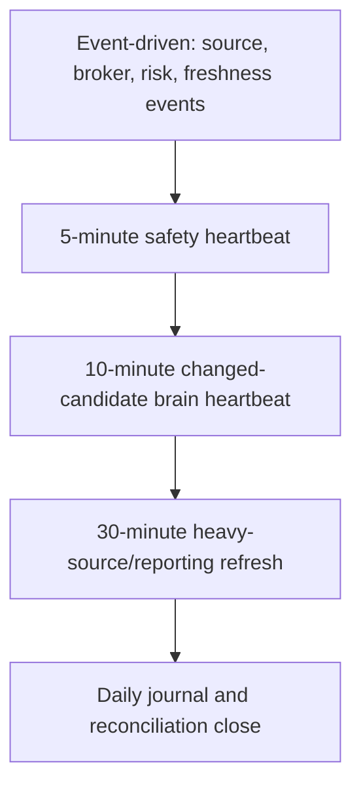

# Realtime Trading Operations Routing Note

This file is a short LLM routing note. It is not source of truth. Verify current state in operating state, task registry, task reports, artifact manifests, and validator outputs.

## Current Verdict

Use `event_driven_plus_10_min_intraday_heartbeat_diagnostic_only`.

Task3411-Task3420 implemented the package-level diagnostic guard that a future scheduler should call before these heartbeats:

- `L0L6DiagnosticRuntimeState`
- deterministic state hash
- cadence/time-bucket idempotency key
- duplicate-state skip
- 5-minute safety vs 10-minute brain separation

Task3422-Task3430 then blocked runtime promotion after a deeper backend audit. Task3431-Task3480 closed the first hardening set. Task3481-Task3500 added lease, idempotency, authority evidence, UNKNOWN-order blocking, reconciliation, and observability contracts. Task3501-Task3529 added package-level dry-run scheduler, single latest-L6 authority, and local broker submit/reconciliation state-machine wrappers. Task3531-Task3560 added operator dry-run scheduler config/scripts, broker truth reconciliation, and a PAPER_ELIGIBLE evidence path that stops at local intent creation. Runtime promotion is still blocked.

Closed in Task3431-3480:

- Task588 supervisor PowerShell parses
- `run_trade_once` fails closed on missing control state
- direct-run dummy order fallback is disabled
- non-paper KIS environment is blocked in the direct runner
- Task585 legacy paper execution is blocked by default
- Task588 records a 5-minute safety heartbeat state hash and skips duplicate state

Closed in Task3501-Task3529:

- `run_diagnostic_scheduler_once` executes one dry-run diagnostic scheduler tick with state-hash idempotency and token-gated lease validation
- `authorize_latest_runtime_decision` selects exactly one latest L6 `RuntimeDecision` candidate and rejects tied latest authority
- `broker_submit_state.py` wraps local paper intent states through authorized creation, SUBMITTING, SUBMITTED_LOCAL_RECORDED, UNKNOWN, RECONCILED, and BLOCKED

Still open:

- operator executing the dry-run scheduler install script on the owned workstation
- live-source-backed paper eligibility evidence beyond fixture/package tests
- broker submit remains separated from PAPER_ELIGIBLE local intent creation

Task3481-Task3530 turns those into the next implementation plan:

- Task3481-3500: full diagnostic scheduler with lease and persisted idempotency
- Task3501-3520: single latest-L6 runtime authority
- Task3521-3530: durable broker submit atomicity

Task3481-Task3485 implemented the professional backend preconditions before those lanes:

- SQLite runtime writes now have busy-timeout and best-effort WAL defaults
- `scheduler_leases` now has token-gated atomic acquire, heartbeat, release, and expired-lease steal semantics
- runtime authority evidence now requires L3/L4/L5/L6 lineage hashes, snapshot ids, valid windows, kill-switch coverage, and complete paper-eligibility evidence
- broker submit idempotency now explicitly requires broker client-order-id support or reconciliation-before-retry

Task3486-Task3500 connected those contracts into runtime safety paths:

- KIS submit accepts local idempotency parameters and rejects unsupported broker client-order ids
- Task585 writes durable `paper_order_intents` before submit and preserves broker-submit/local-record failures as `UNKNOWN`
- `RuntimeDecision` itself now has paper-eligibility validity, snapshot, and lineage fields
- authority evidence can be stored in an append-only hash ledger
- scheduler lease tokens can be validated for stale-worker fencing
- runtime operating metrics expose UNKNOWN order age, reconciliation blocks, intent states, heartbeat statuses, and heartbeat lag

Task3531-Task3560 connected the next runtime operations modules:

- `runtime_scheduler_supervisor` runs due dry-run diagnostic cadences from operator config
- `broker_truth_reconciliation` records KIS paper broker-truth snapshots and reconciliation outcomes
- `paper_eligibility_path` validates full-evidence PAPER_ELIGIBLE latest-L6 authority before local paper intent creation
- install result: Windows ScheduledTask was denied by local permissions; StartupFolderFallback installed `TraderBrainRuntimeDiagnosticScheduler.vbs` as `READY_AT_NEXT_LOGON` with `StartNow=false`

GPT/Chrome review-only added six required P0 controls before paper-runtime consideration:

- global state-machine specification
- lineage immutability
- scheduler singleton lease
- runtime snapshot consistency/versioning
- kill-switch hierarchy
- reconciliation authority/conflict model

Status boundaries:

- Strategy: `NOT_ACCEPTED`
- Deployment: `DIAGNOSTIC_ONLY_NOT_DEPLOYMENT_READY`
- Real Capital: `FORBIDDEN`

## L0-L6 Cadence

| Cadence | Use For | Do Not Use For |
| --- | --- | --- |
| Event-driven | source receipts, broker fills/rejections, risk breaches, freshness breaks | live orders or capital deployment |
| 5 minutes | market/session/account/order-state safety | full brain recompute or paper eligibility |
| 10 minutes | main changed-candidate L0-L6 review-only brain heartbeat | universe-wide execution loop |
| 30 minutes | heavy source/news/SEC/panel refresh and cockpit snapshot | sole risk loop |
| Daily close | journal, reconciliation, blockers, next-day plan | acceptance claim |

## Why Not Full 5-Minute Trading

The L3-L7 review chain exists, but L0/L1 source readiness and L6 paper/broker gates are not complete:

- strict raw/as-of complete rows remain blocked in readiness evidence
- shadow runtime quality is `PARTIAL`
- paper-eligible L6 decisions are 0
- paper order intents are 0
- live orders are 0

Therefore 5 minutes is a safety heartbeat, not a full trading loop.

## Current Reference

- Report: [Task3401-Task3410 L0-L6 realtime ops audit](../reports/task_3401_3410_l0_l6_realtime_ops_audit/task_3401_3410_l0_l6_realtime_ops_audit.md)
- Implementation report: [Task3411-Task3420 L0-L6 diagnostic orchestration](../reports/task_3411_3420_l0_l6_diagnostic_orchestration/task_3411_3420_l0_l6_diagnostic_orchestration.md)
- Runtime audit report: [Task3422-Task3430 backend runtime professional audit](../reports/task_3422_3430_backend_runtime_professional_audit/task_3422_3430_backend_runtime_professional_audit.md)
- Runtime hardening report: [Task3431-Task3480 runtime promotion blocker hardening](../reports/task_3431_3480_runtime_promotion_blocker_hardening/task_3431_3480_runtime_promotion_blocker_hardening.md)
- Next implementation plan: [Task3481-Task3530 runtime scheduler authority atomicity plan](../reports/task_3481_3530_runtime_scheduler_authority_atomicity_plan/task_3481_3530_runtime_scheduler_authority_atomicity_plan.md)
- Runtime atomicity preconditions: [Task3481-Task3485 runtime atomicity preconditions](../reports/task_3481_3485_runtime_atomicity_preconditions/task_3481_3485_runtime_atomicity_preconditions.md)
- Decision: [Task3410 decision](../reports/task_3401_3410_l0_l6_realtime_ops_audit/task_3410_decision.csv)
- Implementation decision: [Task3420 decision](../reports/task_3411_3420_l0_l6_diagnostic_orchestration/task_3420_decision.csv)
- Runtime audit decision: [Task3430 decision](../reports/task_3422_3430_backend_runtime_professional_audit/task_3430_decision.csv)
- Runtime hardening decision: [Task3480 decision](../reports/task_3431_3480_runtime_promotion_blocker_hardening/task_3480_decision.csv)
- Next implementation decision: [Task3530 decision](../reports/task_3481_3530_runtime_scheduler_authority_atomicity_plan/task_3530_decision.csv)
- Runtime preconditions decision: [Task3485 decision](../reports/task_3481_3485_runtime_atomicity_preconditions/task_3485_decision.csv)
- Runtime safety connection report: [Task3486-Task3500 runtime idempotency authority observability](../reports/task_3486_3500_runtime_idempotency_authority_observability/task_3486_3500_runtime_idempotency_authority_observability.md)
- Runtime safety connection decision: [Task3500 decision](../reports/task_3486_3500_runtime_idempotency_authority_observability/task_3500_decision.csv)
- Runtime scheduler authority submit-state report: [Task3501-Task3529 runtime scheduler authority submit state](../reports/task_3501_3529_runtime_scheduler_authority_submit_state/task_3501_3529_runtime_scheduler_authority_submit_state.md)
- Runtime scheduler authority submit-state decision: [Task3529 decision](../reports/task_3501_3529_runtime_scheduler_authority_submit_state/task_3529_decision.csv)
- Runtime scheduler broker truth paper eligibility report: [Task3531-Task3560 runtime scheduler broker truth paper eligibility](../reports/task_3531_3560_runtime_scheduler_broker_truth_paper_eligibility/task_3531_3560_runtime_scheduler_broker_truth_paper_eligibility.md)
- Runtime scheduler broker truth paper eligibility decision: [Task3560 decision](../reports/task_3531_3560_runtime_scheduler_broker_truth_paper_eligibility/task_3560_decision.csv)
- Gap audit: [L0-L6 gap audit](../../data/artifacts/task_3401_3410_l0_l6_realtime_ops_audit/l0_l6_gap_audit.csv)
- Cadence artifact: [realtime cadence recommendation](../../data/artifacts/task_3401_3410_l0_l6_realtime_ops_audit/realtime_cadence_recommendation.csv)
- Orchestration heartbeat decisions: [heartbeat decisions](../../data/artifacts/task_3411_3420_l0_l6_diagnostic_orchestration/heartbeat_decisions.csv)
- Runtime promotion blocker findings: [audit findings](../../data/artifacts/task_3422_3430_backend_runtime_professional_audit/audit_findings.csv)
- Runtime hardening status: [hardening status](../../data/artifacts/task_3431_3480_runtime_promotion_blocker_hardening/hardening_status.csv)
- Next implementation lanes: [implementation lanes](../../data/artifacts/task_3481_3530_runtime_scheduler_authority_atomicity_plan/implementation_lanes.csv)
