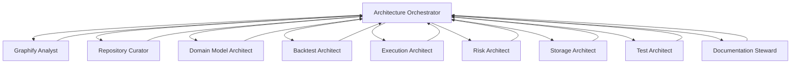

# Orchestrator / Sub-Agent Model

## Operating Principle
The Architecture Orchestrator owns scope, acceptance gates, and final publication. Sub-agents own bounded analysis or documentation slices and return structured handoffs. Sub-agents do not silently mutate trading behavior.

## Delegation Flow



## Agent Definitions

- Architecture Orchestrator: sets phase/task boundaries, resolves conflicts, approves final reports, and blocks scope drift.
- Graphify Analyst: owns graph modes, exclusion rules, community diagnosis, and context packs.
- Repository Curator: owns inventory, target locations, movement risk, and staged migration maps.
- Domain Model Architect: owns canonical layer language and dependency boundaries.
- Backtest Architect: owns backtest/research separation and reliability migration tasks.
- Execution Architect: owns execution lifecycle, broker boundary, cancel/reconcile contracts.
- Risk Architect: owns final approval gates and risk policy placement.
- Storage Architect: owns runtime state and artifact storage conventions.
- Test Architect: owns boundary tests and safe validation commands.
- Documentation Steward: owns templates, reports, indexes, and style consistency.

## Handoff Format

```text
agent:
input_artifacts:
findings:
proposed_changes:
files_touched_or_proposed:
validation:
risks:
next_owner:
```

## Stop Conditions

- Any proposed trading behavior change without an explicit task.
- Any broker/API execution request during architecture normalization.
- Any high-risk move without rollback and approval.
- Any intelligence/LLM artifact that attempts to create trading decisions.

